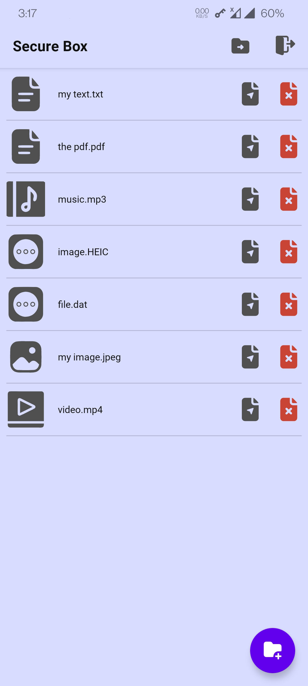

# SecureBoxRecorder android app

Encrypt your files in the Box, behind Voice Recorder app!

## How to use

- Enter your private password(used as Encryption
  Key [AES-BC-128](https://en.wikipedia.org/wiki/Advanced_Encryption_Standard))
- Old-encrypted-data can import here
- Now you see a simple voice Recorder app, but if you enter the password in recorder file name, app
  shows secret files(we called "Box")
- You can Add/Open/Share/Delete files, or Export all files as Encrypted.

## Tech

Kotlin, MVVM-CleanArchitecture, NavigationComponent, Dagger/Hilt, Kotlin-Coroutine, Rx-Android

## Screenshots

